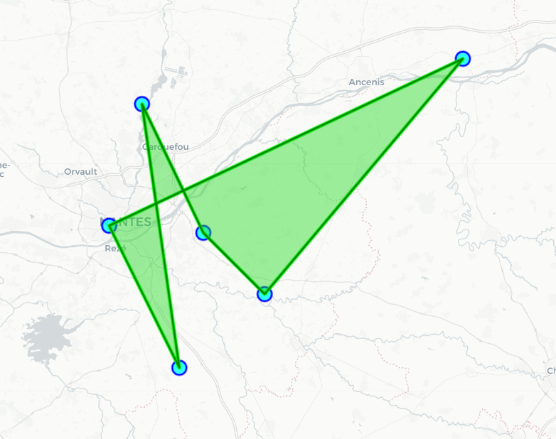

# 📌 CHAMPIONSHIP basket MAP

L'objectif est de creer une carte interactive representant les perimetres englobant les différentes equipes d'un championnat. Donner une meilleure approche graphique des distances entre différentes équipes d'une meme competition.

The goal is to create an interactive map representing the perimeters encompassing the different teams in a championship. This provides a better graphical approach to the distances between different teams in the same competition.

## 🔗 Sommaire

- [🚀 Fonctionnalités (Features)](#-fonctionnalités)
- [🔧 Tester (test)](#-Tester)
- [🙋 Contact](#-contact)

---

## 🚀 Fonctionnalités

- Scrapping des pages de championnats ffbb (récuperer club/ville et classer celon poules)
- Creer carte intéractive + menu permettant d'observer chaque poule sur la carte.
-----------------------------------------------------------------------------------------------

- Scraping FFBB championship pages (retrieving clubs/cities and sorting them by group)
- Creating an interactive map + a menu allowing you to view each group on the map.
---

## 🔧 Tester 

### Première partie : (Scrapping des pages de championnats ffbb (récuperer club/ville et classer celon poules)

Pour récuperer dans un fichier csv les équipes ainsi que l'adresse de leur salle de basket d'une poule (présente sur le site https://competitions.ffbb.com/). Il vous suffit de coller le lien de la page de la poule à analyser (exemple pour la poule F phase 2 D3 loire-atlantique : (https://competitions.ffbb.com/ligues/pdl/comites/0044/competitions/dm3/classement?phase=200000002864683&poule=200000003006254) dans l'espace réserver à celui ci dans le code scraper_ffbb_2.py.

exemple de rendu (fichier adresses_clubs.csv):

| Équipe                                           | Adresse                                  |
|--------------------------------------------------|-------------------------------------------|
| GROUPE ST VINCENT LE PALLET                     | RUE DES SPORTS, 44330 Le Pallet           |
| BASKET CLUB BASSE GOULAINE                      | SQUARE DE THELEY, 44115 Basse-Goulaine    |
| IE - CTC ERDRE CANAL - BASKET CLUB SUCE/ERDRE   | IMPASSE DU LEVANT, 44240 Sucé-sur-Erdre   |
| MONTBERT GENESTON LE BIGNON B.                  | Stade Municipal, 44140 Montbert           |
| ASPTT NANTES                                    | 38 RUE APPERT, 44100 Nantes               |
| USVR VARADES BASKET                             | 450 Rue du Parc, 44370 Varades            |

### Deuxième partie : (Convertir les adresses en position GPS)

Ce projet utilise actuellement l’API Nominatim (OpenStreetMap) via la bibliothèque Python geopy pour convertir des adresses postales en coordonnées GPS (latitude / longitude).

Pourquoi ce choix ?
 
Gratuite et sans inscription. 
Basée sur OpenStreetMap, donc open source.

⚠️ Limites de Nominatim
Nominatim est très utile, mais présente des limitations :

Certaines adresses mal structurées ou incomplètes ne sont pas reconnues. 
Les adresses trop générales ou locales (ex : "Stade Municipal") sont souvent mal interprétées ou non géocodées, problème qu'on a résolu en remplacant l'adresse non exact par le nom de la commune uniquement. Ce changement nous permet d'avoir une adresse au détriement de la précision.

🚀 Évolution prévue : 

bascule vers une API plus robuste
Pour améliorer la précision et la couverture, une future version pourra utiliser l’API Google Maps Geocoding :

✅ Plus fiable pour les adresses incomplètes ou ambigües 
✅ Renvoie un score de confiance et des types de lieux précis 
❗️ Requiert une clé API et l’activation de la facturation (crédit gratuit de 200 $/mois)

🛠️ Améliorations possibles

Ajout d’un fallback automatique : Nominatim → Google Maps API 
Enregistrement des adresses échouées pour correction manuelle 
Cache local des géocodages pour éviter les appels répétés

exemple de rendu (sur le fichier positions_avec_coords.csv) :

| Équipe                                           | Latitude   | Longitude  |
|--------------------------------------------------|------------|------------|
| GROUPE ST VINCENT LE PALLET                     | 47.1419389 | -1.3395804 |
| BASKET CLUB BASSE GOULAINE                      | 47.2063337 | -1.4331207 |
| IE - CTC ERDRE CANAL - BASKET CLUB SUCE/ERDRE   | 47.341551  | -1.5285694 |
| MONTBERT GENESTON LE BIGNON B.                  | 47.0649636 | -1.4709478 |
| ASPTT NANTES                                    | 47.2138644 | -1.5798205 |
| USVR VARADES BASKET                             | 47.3886168 | -1.0325296 |

### Troisième partie : (Affichage de la carte)

🗺️ Génération et affichage de la carte

La carte interactive est générée à partir du fichier positions_avec_coords.csv contenant les coordonnées GPS de chaque équipe. 
Pour cela, on utilise la bibliothèque Python Folium, qui s’appuie sur Leaflet.js pour produire une carte web interactive.

Chaque salle est représentée par un marqueur stylisé , et l’ensemble des points forme un polygone qui délimite la zone géographique couverte par les équipes.
Seuls les points en bordure (calculés avec l’enveloppe convexe, ou convex hull) sont utilisés pour dessiner le polygone afin d’éviter un rendu déformé par des points centraux inclus dans l’aire.

🎨 Style et interaction 
Le polygone a un style visuel personnalisable (couleur, transparence, contour...), et les marqueurs sont interactifs : on peut cliquer dessus pour voir le nom de l’équipe.

🐞 Problème rencontré : 
Au départ, le polygone recouvrait les marqueurs et empêchait l’interaction (clic, survol, etc.).
Cela venait du fait que le calque du polygone interceptait les événements utilisateurs.

✅ Solution : on a désactivé l’interaction sur le polygone (interactive: False) et modifié son style pour qu’il passe sous les marqueurs (effet de "calques", ou z-index dans le navigateur).

---------------------------------------------------------------------------------------------

### First Part: (Scraping FFBB Championship Pages – Retrieving Clubs/Cities and Sorting by Pools)
To extract a CSV file with the teams and their basketball court addresses from a pool (available on the website https://competitions.ffbb.com/), simply paste the link to the pool's page you want to analyze (for example, for Pool F, Phase 2 D3 Loire-Atlantique: https://competitions.ffbb.com/ligues/pdl/comites/0044/competitions/dm3/classement?phase=200000002864683&poule=200000003006254) into the designated space in the code scraper_ffbb_2.py.

Example of output (file adresses_clubs.csv):

| Équipe                                           | Adresse                                  |
|--------------------------------------------------|-------------------------------------------|
| GROUPE ST VINCENT LE PALLET                     | RUE DES SPORTS, 44330 Le Pallet           |
| BASKET CLUB BASSE GOULAINE                      | SQUARE DE THELEY, 44115 Basse-Goulaine    |
| IE - CTC ERDRE CANAL - BASKET CLUB SUCE/ERDRE   | IMPASSE DU LEVANT, 44240 Sucé-sur-Erdre   |
| MONTBERT GENESTON LE BIGNON B.                  | Stade Municipal, 44140 Montbert           |
| ASPTT NANTES                                    | 38 RUE APPERT, 44100 Nantes               |
| USVR VARADES BASKET                             | 450 Rue du Parc, 44370 Varades            |

### Second Part: (Converting Addresses to GPS Coordinates)
This project currently uses the Nominatim (OpenStreetMap) API via the Python library geopy to convert postal addresses into GPS coordinates (latitude / longitude).

Why this choice? 
Free and no registration required. 
Based on OpenStreetMap, so it's open source.

⚠️ Nominatim’s Limitations
While Nominatim is very useful, it has some limitations:

Some poorly structured or incomplete addresses are not recognized. 
Addresses that are too general or local (e.g., "Stade Municipal") are often misinterpreted or not geocoded. This issue was solved by replacing the incomplete address with just the city name. This adjustment sacrifices precision for availability.

🚀 Planned Evolution: 

Moving to a More Robust API
To improve accuracy and coverage, a future version may switch to the Google Maps Geocoding API:

✅ More reliable for incomplete or ambiguous addresses 
✅ Returns confidence scores and precise location types 
❗️ Requires an API key and billing activation (free credit of $200/month)

🛠️ Possible Improvements

Add an automatic fallback: Nominatim → Google Maps API 
Log failed addresses for manual correction 
Local caching of geocodes to avoid repeated calls

Example of output (file positions_avec_coords.csv):

| Équipe                                           | Latitude   | Longitude  |
|--------------------------------------------------|------------|------------|
| GROUPE ST VINCENT LE PALLET                     | 47.1419389 | -1.3395804 |
| BASKET CLUB BASSE GOULAINE                      | 47.2063337 | -1.4331207 |
| IE - CTC ERDRE CANAL - BASKET CLUB SUCE/ERDRE   | 47.341551  | -1.5285694 |
| MONTBERT GENESTON LE BIGNON B.                  | 47.0649636 | -1.4709478 |
| ASPTT NANTES                                    | 47.2138644 | -1.5798205 |
| USVR VARADES BASKET                             | 47.3886168 | -1.0325296 |

### Part Three: (Map Display)

🗺️ Map Generation and Display

The interactive map is generated from the `positions_avec_coords.csv` file, which contains the GPS coordinates of each team. 
We use the Python library **Folium**, built on top of Leaflet.js, to create an interactive web map.

Each gymnasium is represented by a custom-styled marker, and all points are connected to form a polygon that outlines the geographic area covered by the teams.  
Only the outermost points (calculated using the convex hull) are used to draw the polygon to avoid distortions caused by central points included in the area.

🎨 Style and Interaction   
The polygon has a fully customizable visual style (color, transparency, borders...), and the markers are interactive: clicking on them shows the team name.

🐞 Issue Encountered:  
Initially, the polygon layer was blocking the markers and preventing interaction (click, hover, etc.).
This happened because the polygon layer was intercepting user events.

✅ Solution: We disabled interactivity on the polygon (`interactive: False`) and adjusted its style so it appears below the markers (layering effect, similar to z-index in web browsers).

## 🙋 Contact

Tu peux me retrouver ici : 

- GitHub: @ewenlc
- LinkedIn: Ewen Le Callet (www.linkedin.com/in/ewen-le-callet-4b30282a8)
- Email: ewen.lecallet@gmail.com
